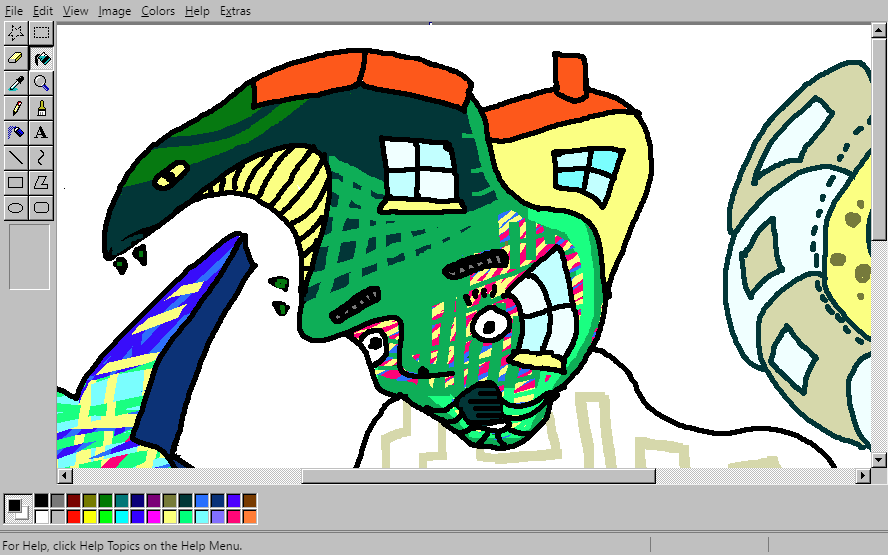
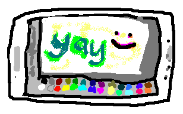

# [ JS Paint](https://jspaint.app)

A nice web-based MS Paint remake and more... [Try it out!](https://jspaint.app)

The goal is to remake MS Paint
(including its [little-known features](#did-you-know)),
improve on it, and to extend the types of images it can edit.
So far, it does this pretty well.

Ah yes, good old paint. Not the one with the [ribbons][]
or the [new skeuomorphic one][Fresh Paint] with the interface that can take up nearly half the screen.
(And not the even newer [Paint 3D][].)

[ribbons]: https://www.google.com/search?tbm=isch&q=MS+Paint+Windows+7+ribbons "Google Search: MS Paint Windows 7 ribbons"
[Fresh Paint]: https://www.google.com/search?tbm=isch&q=MS+Fresh+Paint "Google Search: MS Fresh Paint"
[Paint 3D]: https://www.microsoft.com/en-us/store/p/paint-3d-preview/9nblggh5fv99

Windows 95, 98, and XP were the golden years of paint.
You had a tool box and a color box, a foreground color and a background color,
and that was all you needed.

Things were simple.

But we want to undo more than three actions.
We want to edit transparent images.
We can't just keep using the old paint.

So that's why I'm making JS Paint.
I want to bring good old paint into the modern era.

#### Current improvements include:

* Cross-platform
* Unlimited undos/redos (as opposed to a measly 3 in Windows XP,
  or a measly 50 in Windows 7)
* Undo history is *nonlinear*, which means if you undo and do something other than redo, the redos aren't discarded. Instead, a new branch is created in the *history tree*. Jump to any point in history with **Edit > History** or <kbd>Ctrl+Shift+Y</kbd>
* Automatically keeps a backup of your image. Only one backup per image tho, which doesn't give you a lot of safety. Remember to save with **File > Save** or <kbd>Ctrl+S</kbd>! Manage backups with **File > Manage Storage**.
* Edit transparent images! To create a transparent image,
  go to **Image > Attributes...** and select Transparent,
  then OK, and then **Image > Clear Image** or use the Eraser tool.
  Images with *any* translucent pixels will open in Transparent mode.
* Switch themes from the Extras menu. Dark mode included.
* [Vertical Color Box mode](https://jspaint.app/#vertical-color-box-mode), accessible from **Extras > Vertical Color Box**
* [Eye Gaze Mode](https://jspaint.app/#eye-gaze-mode), for use with an eye tracker, head tracker, or other coarse input device, accessible from **Extras > Eye Gaze Mode**. (With just a webcam, you can try it out with [Enable Viacam](https://eviacam.crea-si.com/) (head tracker) or [GazePointer](https://sourceforge.net/projects/gazepointer/) (eye tracker).)
* [Speech Recognition Mode](https://jspaint.app/#speech-recognition-mode).
  Using your voice you can select tools and colors, pan the view ("scroll down and to the left", or "go southwest", etc.), explore the menus (but you can activate any menu item without opening the menus first), interact with windows (including scrolling the history view with "scroll up"/"scroll down" etc.), dictate text with the Text tool, and even tell the application to sketch things (for instance, "draw a house")
* Create an animated GIF from the current document history.
  Accessible from the Extras menu or with <kbd>Ctrl+Shift+G</kbd>.
  It's pretty nifty, you should try it out!
  You might want to limit the size of the image though.
* You can shoot at the application [Asteroids style](https://kickassapp.com/)
* When you do **Edit > Paste From...** you can select transparent images.
  ~~You can even paste a transparent animated GIF and then
  hold <kbd>Shift</kbd> while dragging the selection to
  smear it across the canvas *while it animates*!~~
  Update: This was [due to not-to-spec behavior in Chrome.](https://christianheilmann.com/2014/04/16/browser-inconsistencies-animated-gif-and-drawimage/)
  I may reimplement this in the future as I really liked this feature.
* You can open SVG files, though only as a bitmap.
  (Note: it may open super large, or tiny. There's no option to choose a size when opening.)
* You can crop the image by making a selection while holding <kbd>Ctrl</kbd>
* Keyboard shortcuts for rotation: <kbd>Ctrl+.</kbd> and <kbd>Ctrl+,</kbd> (<kbd><</kbd> and <kbd>></kbd>)
* Rotate by any arbitrary angle in **Image > Flip/Rotate**
* In **Image > Stretch/Skew**, you can stretch more than 500% at once
* Zoom to an arbitrary scale in **View > Zoom > Custom...**
* Zoom to fit the canvas within the window with **View > Zoom > Zoom To Window**
* Non-contiguous fill: Replace a color in the entire image by holding <kbd>Shift</kbd> when using the fill tool
* You can use the Text tool at any zoom level, and it previews the exact pixels that will end up on the canvas.
* Spellcheck is available in the textbox if your browser supports it.
* Rudimentary **multi-user** support.
  Start up a session at
  [jspaint.app/#session:multi-user-test](https://jspaint.app/#session:multi-user-test)
  and send the link to your friends!
  It isn't seamless; actions by other users interrupt what you're doing, and visa versa.
  Sessions are not private, and you may lose your work at any time.
  If you want better collaboration support, follow the development of [Mopaint](https://github.com/1j01/mopaint).
* Load many different palette formats with **Colors > Get Colors**.
  (I made a [library](https://github.com/1j01/palette.js/) for this.)
* Touch support: use two fingers to pan the view.
* Click/tap the selected colors area to swap the foreground and background colors

#### Limitations:

A few things with the tools aren't done yet.
See [TODO.md](TODO.md#Tools)

Full clipboard support in the web app requires a browser supporting the [Async Clipboard API w/ Images](https://developers.google.com/web/updates/2019/07/image-support-for-async-clipboard), namely Chrome 76+ at the time of writing.

In other browsers you can still can copy with <kbd>Ctrl+C</kbd>, cut with <kbd>Ctrl+X</kbd>, and paste with <kbd>Ctrl+V</kbd>,
but data copied from JS Paint can only be pasted into other instances of JS Paint.
External images can be pasted in.

## Did you know?

* There's a black and white mode with *patterns* instead of colors in the palette,
  which you can get to from **Image > Attributes...**

* You can drag the color box and tool box around if you grab them by the right place.
  You can even drag them out into little windows.
  You can dock the windows back to the side by double-clicking on their title bars.

* In addition to the left-click foreground color and the right-click background color,
  there's a third color you can access by holding <kbd>Ctrl</kbd> while you draw.
  It starts out with no color so you'll need to hold <kbd>Ctrl</kbd> and select a color first.
  The fancy thing about this color slot is you can
  press and release <kbd>Ctrl</kbd> to switch colors *while drawing*.

* You can apply image transformations like Flip/Rotate, Stretch/Skew or Invert (in the Image menu) either to the whole image or to a selection.
  Try scribbling with the Free-Form Select tool and then doing **Image > Invert**

* These Tips and Tricks from [a tutorial for MS Paint](https://www.albinoblacksheep.com/tutorial/mspaint)
  also work in JS Paint:

	* [x] Brush Scaling (<kbd>+</kbd> & <kbd>-</kbd> on the Numpad to adjust brush size)
	* [x] "Custom Brushes" (hold <kbd>Shift</kbd> and drag the selection to smear it)
	* [x] The 'Stamp' "Tool" (hold <kbd>Shift</kbd> and click the selection to stamp it)
	* [x] Image Scaling (<kbd>+</kbd> & <kbd>-</kbd> on the Numpad to scale the selection by factors of 2)
	* [x] Color Replacement (right mouse button with Eraser to selectively replace the foreground color with the background color)
	* [x] The Grid (<kbd>Ctrl+G</kbd> & Zoom to 4x+)
	* [x] Quick Undo (Pressing a second mouse button cancels the action you were performing.
	      I also made it redoable, in case you do it by accident!)
	* [ ] Scroll Wheel Bug (Hmm, let's maybe not recreate this?)

## Desktop App

JS Paint can be installed as a PWA, altho it doesn't work offline.

(Also I made some effort to build it into a desktop app with [Electron][] and [Electron Forge][], but this will use unnecessary system resources and is not recommended. See [this issue](https://github.com/1j01/jspaint/issues/2).)

[Electron]: https://electronjs.org/
[Electron Forge]: https://electronforge.io/

## Development Setup

[Clone the repo.](https://help.github.com/articles/cloning-a-repository/)

Install [Node.js][] if you don't have it, then open up a command prompt / terminal in the project directory.

### Testing

Run `npm run lint` to check for code problems.

Run `npm test` to run browser-based tests with Cypress. (It's slow to start up and run tests, unfortunately.)

Run `npm run accept` to accept any visual changes.
This unfortunately re-runs all the tests, rather than accepting results of the previous test, so you could end up with different results than the previous test.
If you use [GitHub Desktop](https://desktop.github.com/), you can view diffs of images, in four different modes.

To open the Cypress UI, first run `npm run test:start-server`, then concurrently `npm run cy:open`

Tests are also run in continuous integration [with Travis CI](https://travis-ci.org/1j01/jspaint).

### Web App (https://jspaint.app)

After you've installed dependencies with `npm i`,
use `npm run dev` to start a live-reloading server.

Make sure any layout-important styles go in `layout.css`.
When updating `layout.css`, a right-to-left version of the stylesheet is generated, using [RTLCSS](https://rtlcss.com/).  
You should test the RTL layout by changing the language to Arabic or Hebrew.
Go to **Extras > Language > العربية** or **עברית**.  
See [Control Directives](https://rtlcss.com/learn/usage-guide/control-directives/) for how to control the RTL layout.

### Desktop App (Electron)

This is unreleased and not in development.

- Install dependencies with `npm i`
- Start the electron app with `npm run electron:start`

[electron-debug][] and [devtron][] are included, so you can use <kbd>Ctrl+R</kbd> to reload and <kbd>F12</kbd>/<kbd>Ctrl+Shift+I</kbd> to open the devtools, and there's a Devtron tab with tools specific to Electron.

You can build for production with `npm run electron:make`

[Live Server]: https://github.com/tapio/live-server
[Node.js]: https://nodejs.org/
[electron-debug]: https://github.com/sindresorhus/electron-debug
[devtron]: https://electronjs.org/devtron
